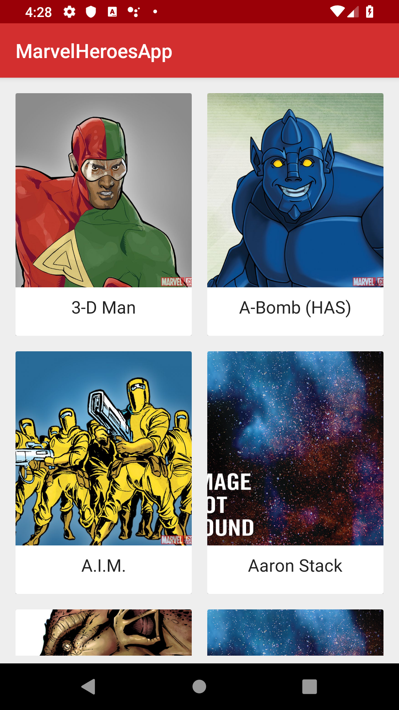

# MarvelHeroesApp

This app contains a list of characters from marvel api as you can see on the image below:

Libraries used to build the app:

- Retrofit;
- Architecture components (LiveData+ViewModel)
- RxJava;
- Glide
- OkHttp.
